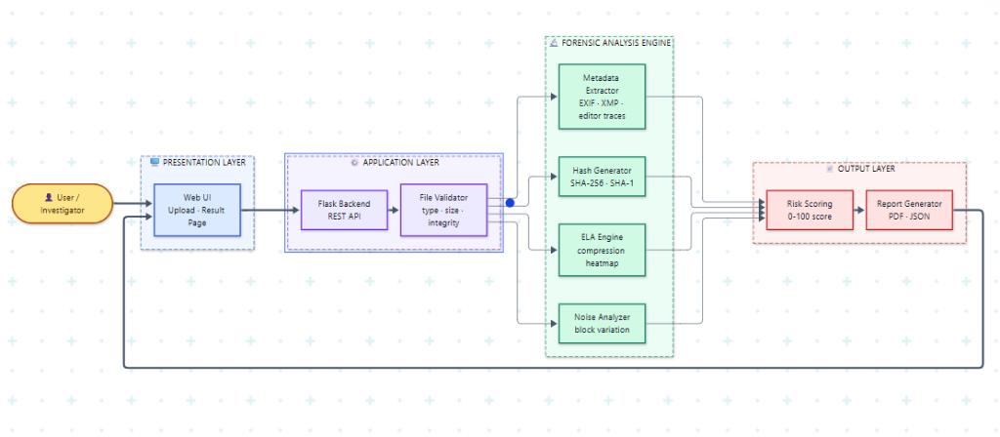
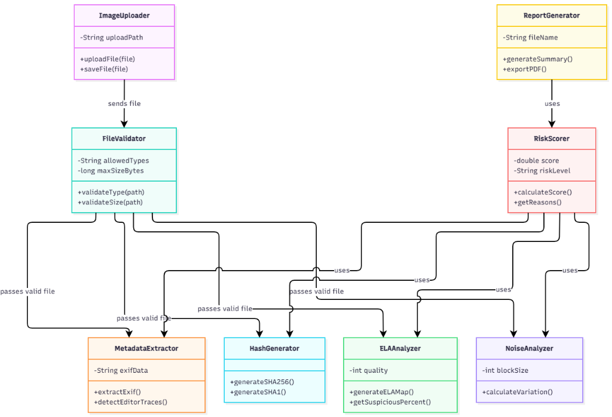
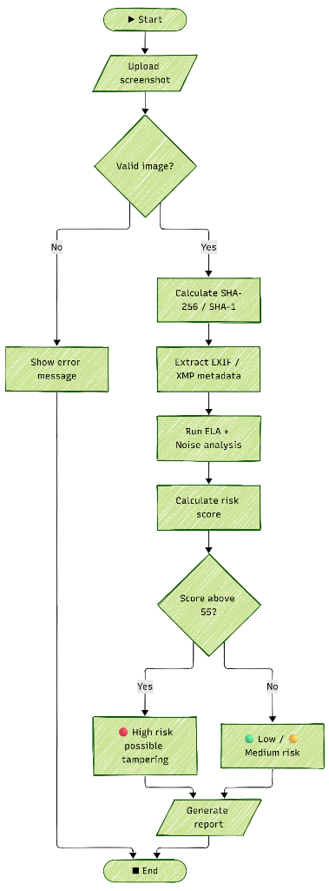
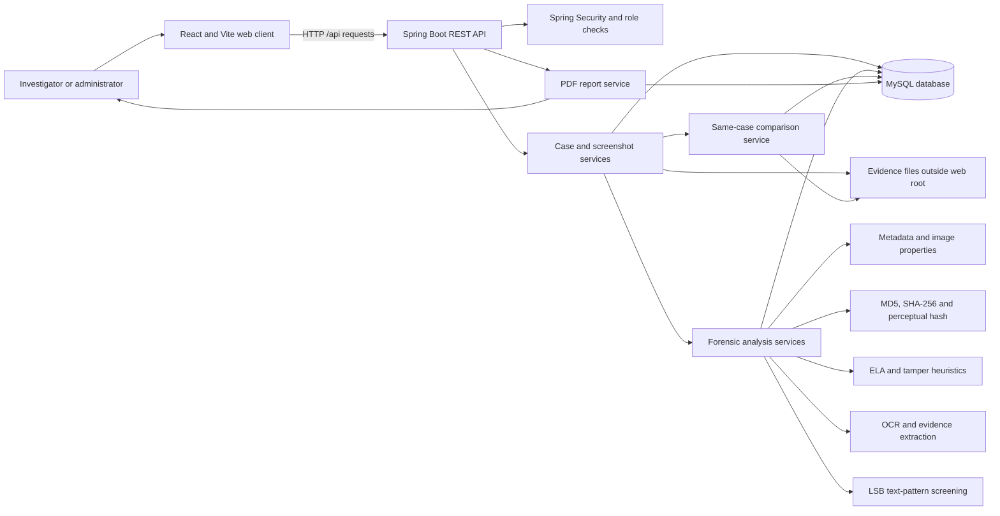
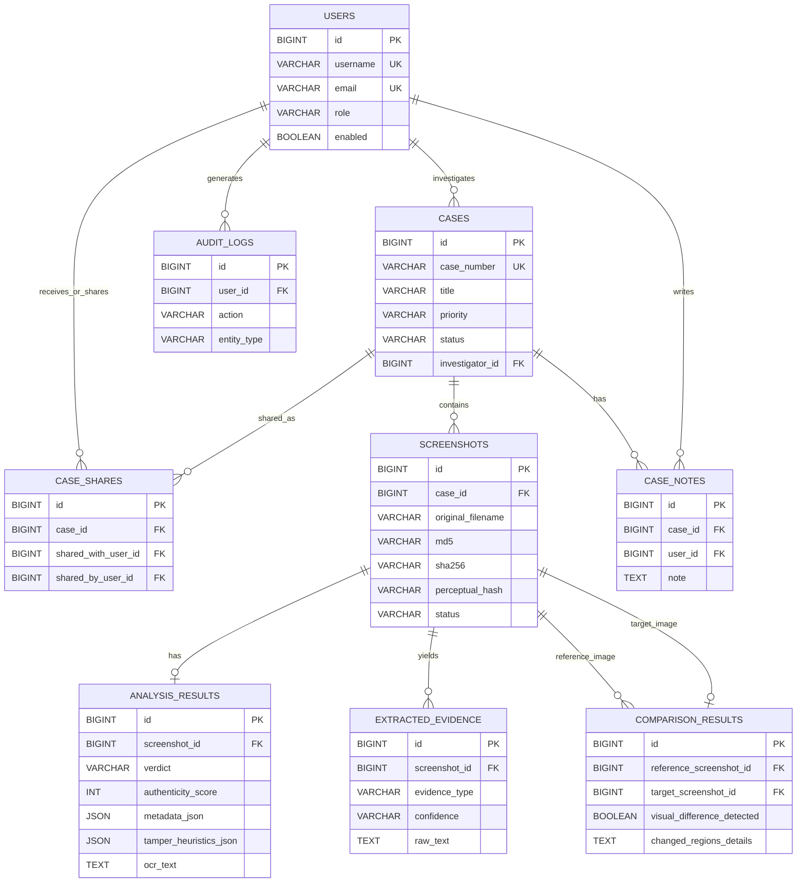
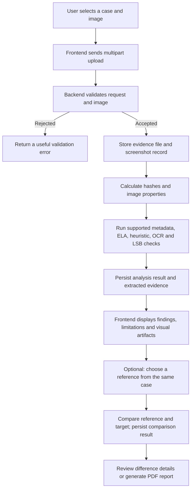

# Digital Forensic Screenshot Analyzer

An evidence-oriented web application for analyzing screenshots, reviewing forensic indicators, and comparing images within a case.

---

## Project Administration

**Project Guide:** [Add guide name]  
**Project Type:** Academic team project  
**Repository:** [Digital-Forensic-Screenshot-Analyzer](https://github.com/RohitSuthar01/Digital-Forensic-Screenshot-Analyzer)

### Team Members and Responsibilities

The roles below describe the team's planned work distribution. They are not a claim about individual Git authorship. Enrollment numbers were not provided.

| Member | Assigned role / module | Email | Mobile |
| :--- | :--- | :--- | :--- |
| Rohit Suthar (Team Lead) | Backend integration, authentication/security coordination, case workflow, and repository integration | rohitsutharrr@gmail.com | 7426033714 |
| Ritika Sharma | Frontend UI/UX, React pages, responsive layouts, and API integration | ritikasharmapinjor@gmail.com | 91382 66159 |
| Ronak Thadani | Case/database workflow, data model coordination, and persistence support | thadanir8@gmail.com | 80003 87244 |
| Tanishk | Forensic analysis module: metadata, hashing, ELA, OCR, and steganography screening | tanishk.99s99@gmail.com | 94611 16756 |
| Rishi | Quality assurance, workflow verification, test cases, and report review | Not provided | 84410 00770 |

---

## Abstract

Screenshots are frequently used as evidence, but their appearance alone cannot establish whether they are original, altered, or copied. Basic metadata viewers provide limited information, while manual review of multiple files is time-consuming. A reliable workflow needs to preserve uploaded evidence and present useful indicators without treating any single signal as proof.

Digital Forensic Screenshot Analyzer is a web application built with a React frontend and a Java Spring Boot backend. Investigators organize screenshots into cases, inspect file metadata and cryptographic fingerprints, review error-level and tampering heuristics, extract visible text and evidence candidates with OCR, screen for some sequential LSB text patterns, and compare screenshots belonging to the same case.

The application combines these checks into a reviewable analysis result, including explanations and visual artifacts where supported. Its outputs are screening indicators for a human investigator; they do not guarantee that an image is authentic or manipulated. The project stores case and analysis records in MySQL and keeps uploaded evidence files outside the web root.

---

## System Architecture & Flow

### High-Level Architecture


### Core Analysis Class Diagram


### Execution Flowchart


---


## Features

- Register and sign in to the application with role-based access controls.
- Create and manage investigation cases, case notes, and case sharing.
- Upload supported PNG, JPEG, and BMP image files to a case, subject to the configured 10 MB per-file limit.
- Preserve the uploaded file and record MD5, SHA-256, file size, and a perceptual hash where available.
- Inspect image format, dimensions, color information, and available EXIF/metadata.
- Run Error Level Analysis (ELA) for supported JPEG images and review its heatmap as a visual aid.
- Calculate conservative tampering heuristics and an explained screening verdict.
- Run OCR to extract visible text and candidate URLs, email addresses, phone numbers, IP addresses, amounts, and dates when recognizable.
- Screen RGB channels for readable text patterns that may be embedded with some sequential LSB techniques.
- Compare a target screenshot with a reference screenshot from the same case and review the difference map and comparison details.
- Generate PDF reports and review dashboard, case, and audit information according to account permissions.
- Expose API documentation through Springdoc at `/swagger-ui.html` when the backend is running.

### Forensic Interpretation Limits

- A matching MD5 or SHA-256 means the file bytes match; it does not establish who created the image or whether it is truthful.
- Different cryptographic hashes mean the files are not byte-for-byte identical. Re-encoding, resizing, metadata changes, or a single pixel change can cause different hashes without proving malicious editing.
- ELA is most useful as a review aid for supported JPEG inputs. It can be affected by compression history and is not a definitive detector.
- LSB screening is limited to patterns the implemented scanner can recognize. A negative result does not rule out encrypted, compressed, non-text, randomized, length-prefixed, or otherwise unsupported hidden payloads.
- OCR and evidence extraction may miss text or misread characters, especially in small, blurred, stylized, or low-resolution images.
- Similarity, risk scores, metadata, and heuristics must be interpreted together with source records and other evidence.

---

## User Roles

The application defines `ADMIN`, `INVESTIGATOR`, and `VIEWER` roles. Exact access is enforced by the backend security configuration and should be checked there when changing permissions.

| Role | Intended use |
| :--- | :--- |
| `ADMIN` | Administrative user management and audit/oversight screens, in addition to permitted application workflows. |
| `INVESTIGATOR` | Create and work with cases, upload and analyze screenshots, and review results for cases they can access. |
| `VIEWER` | Read-only review of cases or results made available to the account. |

---

## Architecture and Core Modules

### 1. Web User Interface

The React 18 application uses Vite, React Router, and Axios. It provides authentication, dashboards, case screens, upload and analysis pages, comparison controls, and report access. The Vite development server proxies `/api` requests to the backend.

### 2. Authentication and Authorization

The Spring Security configuration protects backend endpoints and supports the application's session-based login flow. Roles distinguish administration, investigation, and read-only access. Passwords are handled by the backend security layer; never add credentials or production secrets to this README or source control.

### 3. Case and Evidence Management

Spring MVC controllers and services manage cases, notes, case sharing, screenshot records, and access checks. Uploaded evidence files are stored under `${user.home}/dfsa-uploads` by default, outside the frontend's public directory.

### 4. Forensic Analysis

The analysis services use Metadata Extractor for image metadata, hashing utilities for file fingerprints, ELA and tamper-heuristic components for review indicators, Tess4J/Tesseract for OCR, and an LSB screening component for supported readable text patterns. Unsupported operations and limitations should be visible in the returned explanation rather than interpreted as a clean bill of authenticity.

### 5. Same-Case Image Comparison

The comparison service compares a target screenshot to a selected reference screenshot and persists the result and difference-map details. Both screenshots must belong to the same case. Comparison findings describe visual differences; they do not alone identify which image is the original or prove intent.

### 6. Reporting and Oversight

The report service creates PDF reports from stored case and analysis data. Dashboard and admin/audit services provide activity summaries and oversight information for users with the required access.

---

## Tech Stack

| Area | Technologies |
| :--- | :--- |
| Backend | Java 17, Spring Boot 3.2, Spring MVC, Spring Data JPA, Spring Security, Bean Validation |
| Build | Maven; Maven Wrapper is included under `backend/` |
| Database | MySQL with SQL schema initialization and JPA repositories |
| Frontend | React 18, JavaScript, Vite 4, React Router, Axios |
| UI and visualization libraries | Bootstrap, Framer Motion, Recharts, Three.js, React Three Fiber, Drei, Troika Three Text |
| Forensic libraries | Metadata Extractor, Tess4J/Tesseract, Apache Commons Codec, OpenPDF |
| API documentation | Springdoc OpenAPI / Swagger UI |
| Tests | JUnit/Spring Boot Test, Mockito, Spring Security Test, frontend production build |

---

## UML / Architecture Diagram



---

## Database and Data Flow Design

### Entity Relationship Diagram



### Analysis Data Flow



---

## UI Screenshots

Add current screenshots of the running application to the `image/` folder using these exact names:


The screenshot files were not present in the repository when this README was prepared. Replace these placeholders after capturing the pages from a running local application.

---

## Project Directory Structure

```text
dfsa/
├── backend/
│   ├── .mvn/wrapper/
│   ├── mvnw
│   ├── mvnw.cmd
│   ├── pom.xml
│   ├── tessdata/
│   └── src/
│       ├── main/java/com/dfsa/
│       │   ├── config/       # Security and application configuration
│       │   ├── controller/   # REST endpoints
│       │   ├── dto/          # API request/response objects
│       │   ├── forensic/     # Image analysis algorithms
│       │   ├── mapper/       # Entity and DTO mapping
│       │   ├── model/        # JPA entities and roles
│       │   ├── repository/   # Persistence queries
│       │   ├── security/     # Authentication support
│       │   ├── service/      # Application workflows
│       │   └── util/         # Shared utilities
│       ├── main/resources/   # Properties, schema.sql, and data.sql
│       └── test/             # Backend tests
├── frontend/
│   ├── package.json
│   ├── vite.config.js
│   └── src/
│       ├── api/
│       ├── components/
│       ├── context/
│       ├── hooks/
│       ├── pages/
│       ├── routes/
│       ├── styles/
│       └── three/
├── maven/                    # Maven distribution files in this repository
├── .gitignore
└── README.md
```

---

## Module-wise Work Distribution

| Member | Module | Key deliverables |
| :--- | :--- | :--- |
| Rohit Suthar | Team leadership and backend integration | Coordinate branch integration, authentication/security, case and screenshot workflows, and end-to-end application integration. |
| Ritika Sharma | Frontend and UI/UX | React pages and reusable UI, responsive case/upload/result screens, API connection, and user-facing error/loading states. |
| Ronak Thadani | Case and database workflow | MySQL/JPA case data model coordination, case lifecycle, persistence checks, and data consistency review. |
| Tanishk | Forensic analysis | Metadata and image properties, hashing, ELA/tamper indicators, OCR evidence extraction, and LSB screening. |
| Rishi | Testing and reporting | Test scenarios for login, case/upload/analyze/compare/report flows; regression checks; and clear documentation of limitations and defects. |

---

## Week-wise Project Report and Development History

The available repository history records changes on **October 7 and October 9, 2026**. It does not verify a 12-week calendar schedule, so the entries below are grouped by development phase rather than presented as invented academic week dates. The commit history currently attributes the listed commits to the repository account `RohitSuthar01`; the responsibility table above is the planned team allocation.

| Phase | Work recorded in the repository | Result |
| :--- | :--- | :--- |
| Phase 1 — Backend foundation (Oct 7) | Backend forensic overhaul, API and service work, OCR setup, and ELA fixes. | Backend workflows and analysis components were advanced. |
| Phase 2 — Frontend integration (Oct 7) | Frontend changes for the application screens and backend integration. | React interface updates were committed. |
| Phase 3 — Comparison workflow (Oct 9) | Comparison eligibility, error handling, UI behavior, difference metrics, and persistence/schema fixes. | Same-case reference-image comparison was added and refined. |
| Phase 4 — Analysis refinements (Oct 9) | Forensic analysis improvements, LSB screening, image fingerprints, and comparison-related updates. | More analysis indicators and evidence comparison details were added. |
| Phase 5 — Configuration and data access (Oct 9) | Application configuration loading and custom JPA query improvements. | Backend configuration and selected user queries were refined. |

For a formal weekly submission, replace these phases with the team's verified week numbers and dated work logs. Do not infer individual contributions from the shared branch history alone.

---

## Testing and Challenges

| Module | Common challenge | Handling / verification approach |
| :--- | :--- | :--- |
| Upload and evidence storage | Rejecting invalid images and avoiding filename/path problems; keeping evidence separate from public frontend files. | Validate file content and supported types, retain a generated stored name, store outside the web root, and test boundary sizes and invalid uploads. |
| Metadata and hashes | Many screenshots have no EXIF; byte hashes change after harmless re-encoding. | Show available metadata without treating missing EXIF as failure; distinguish exact-file hashes from visual similarity. |
| ELA and heuristics | ELA can be unsupported for non-JPEG images and image compression can create misleading patterns. | Report whether ELA ran, expose the output as a review aid, and explain limitations instead of deriving a definitive verdict from ELA alone. |
| OCR and evidence extraction | Small, blurred, or stylized text may be missed or misread; OCR runtime data must be available. | Use the configured Tess4J/Tesseract language data, handle OCR failures as analysis limitations, and manually review extracted evidence. |
| LSB screening | A scanner cannot recognize every steganography method or encrypted payload. | Describe the implemented scan as limited pattern screening; test known supported text fixtures and avoid claiming a negative scan proves absence. |
| Image comparison | Cross-case comparison can mix unrelated evidence; changed dimensions and re-encoding complicate pixel differences. | Enforce same-case selection, reject invalid/self comparisons, persist the method and limitations, and test identical and altered fixture pairs. |
| Authentication and persistence | Incorrect role access or database configuration can break application workflows. | Verify role-protected routes and configure MySQL before starting; keep real credentials out of committed documentation and source files. |

### Test Commands

Run backend unit tests:

```powershell
cd backend
./mvnw test
```

On Windows Command Prompt, use:

```cmd
cd backend
mvnw.cmd test
```

Build the frontend:

```powershell
cd frontend
npm ci
npm run build
```

---

## Installation and Usage

### Prerequisites

- Java 17
- MySQL 8 or a compatible MySQL server
- Node.js and npm
- A Git client
- Tesseract language data for OCR; the repository includes `backend/tessdata/eng.traineddata`, but native/runtime setup may still depend on the operating system.

### 1. Clone the Repository

```powershell
git clone https://github.com/RohitSuthar01/Digital-Forensic-Screenshot-Analyzer.git
cd Digital-Forensic-Screenshot-Analyzer
```

### 2. Create the Database

Create a MySQL database named `dfsa` using your MySQL client:

```sql
CREATE DATABASE dfsa;
```

The backend initializes its tables from `backend/src/main/resources/schema.sql` when it starts. Configure the database URL, username, and password locally using environment-specific configuration. Do not commit real passwords. The checked-in application properties currently contain a database password and should be changed to use environment variables before sharing or publishing this repository.

### 3. Start the Backend

In PowerShell, set your local database values for this terminal session, then start Spring Boot:

```powershell
cd backend
$env:SPRING_DATASOURCE_URL = "jdbc:mysql://localhost:3306/dfsa?useSSL=false&serverTimezone=UTC&allowPublicKeyRetrieval=true"
$env:SPRING_DATASOURCE_USERNAME = "your_mysql_username"
$env:SPRING_DATASOURCE_PASSWORD = "your_mysql_password"
./mvnw spring-boot:run
```

The API listens on `http://localhost:8091`. Swagger UI is configured at `http://localhost:8091/swagger-ui.html`.

### 4. Start the Frontend

Open a second terminal from the repository root:

```powershell
cd frontend
npm ci
npm run dev
```

Open the local URL printed by Vite, normally `http://localhost:5188`. The development server proxies `/api` requests to `http://localhost:8091` by default. Set `DFSA_API_PROXY_TARGET` if your backend uses another local address.

### 5. Use the Analyzer

1. Register or sign in with an account permitted by the application.
2. Create or open a case.
3. Upload a supported screenshot and wait for processing to finish.
4. Review the analysis details, image properties, hashes, and any available ELA/OCR/LSB results.
5. To compare images, select a reference screenshot from the same case as the target and run the comparison.
6. Review the comparison map and limitations; download a PDF report if needed.

---

## Future Scope

- Add a reproducible labeled evaluation set and publish precision/recall results for each supported detection method.
- Improve analysis provenance with versioned algorithms, complete processing logs, and chain-of-custody export.
- Add more robust OCR language selection and clearer reporting of OCR confidence and failures.
- Extend image comparison with explicit alignment and robust handling of different dimensions, while retaining the original files.
- Add broader steganalysis methods with clearly measured limits and test fixtures.
- Add automated end-to-end tests for authentication, case isolation, uploading, analysis, same-case comparisons, and report downloads.
- Move database credentials to environment variables or a secrets manager and configure deployment-grade session, CORS, and logging settings.
- Add a documented license after the project owners choose one.

---

## License

No `LICENSE` file was present in the repository when this README was prepared. All rights and permissions therefore remain unspecified; add a license file only after the project owners select the intended license.
