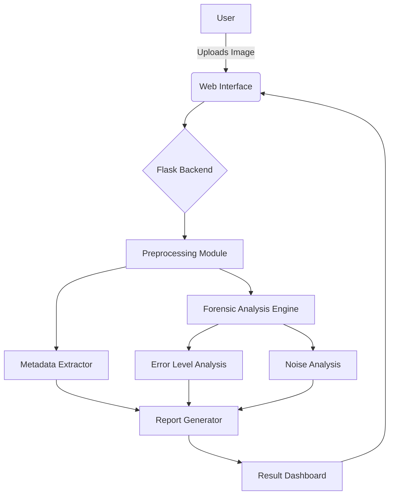
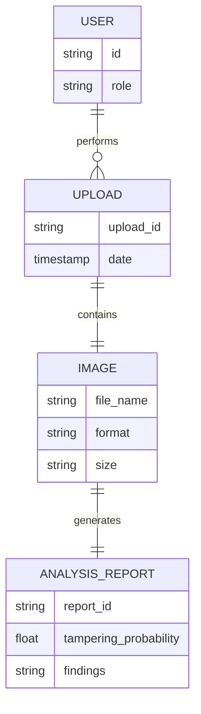

# Digital Forensic Screenshot Analyzer
A powerful forensic tool to analyze, verify, and authenticate digital screenshots.

---

## Project Administration

| Role | Details |
|------|---------|
| **Guide** | [naam] |
| **Team Member 1** | [naam], [enrollment no.] |
| **Team Member 2** | [naam], [enrollment no.] |

---

## Abstract

In the modern digital era, screenshots are frequently used as evidence in legal, corporate, and personal disputes. However, with the rise of advanced image editing tools, it has become increasingly easy to tamper with digital images, raising significant concerns regarding their authenticity and reliability as proof.

This project introduces the Digital Forensic Screenshot Analyzer, an automated solution designed to detect manipulation and tampering in screenshots. By utilizing advanced image processing techniques, metadata extraction, and error level analysis (ELA), the system systematically investigates digital images to uncover hidden modifications. 

The result is a comprehensive forensic report that highlights tampered regions and verifies the image's integrity. This tool aims to assist forensic experts, legal professionals, and everyday users in establishing the credibility of digital evidence quickly and accurately.

---

## Features

* **Metadata Analysis:** Extracts and examines EXIF data to find inconsistencies in image creation and modification details.
* **Error Level Analysis (ELA):** Highlights areas with differing compression levels to detect spliced or edited regions.
* **Noise Analysis:** Detects inconsistencies in background noise that often indicate image manipulation.
* **Format Verification:** Checks for structural anomalies within the image file format.
* **Detailed Reporting:** Generates an easy-to-understand forensic report indicating the likelihood of tampering.

---

## User Roles

* **Admin / Forensic Expert:** Has full access to upload images, run deep forensic scans, view detailed technical logs, and export reports.
* **Standard User:** Can upload screenshots for basic authenticity checks and receive a simplified verification result.

---

## Architecture & Core Modules

1. **Upload & Preprocessing Module:** Handles the ingestion of image files, validates formats, and resizes or normalizes them for consistent analysis.
2. **Metadata Extraction Module:** Parses the image headers and EXIF data to retrieve historical and device information.
3. **Forensic Analysis Engine:** The core module that runs various algorithms including ELA, Noise Analysis, and pixel-level tampering detection using OpenCV and Pillow.
4. **Reporting Module:** Compiles the findings from the analysis engine into a structured, readable format and flags potential manipulations.

---

## Tech Stack

| Component | Technology |
|-----------|------------|
| **Language** | Python |
| **Backend Framework**| Flask |
| **Image Processing** | Pillow, OpenCV |
| **Frontend** | HTML, CSS, JavaScript |

---

## UML / Architecture Diagram



---

## Database / Data Flow



---

## UI Screenshots

### Home Page


### Upload Page


### Result Page


---

## Project Directory Structure

```text
ScreenShot_Detector/
├── backend/
│   ├── app.py                  # Flask application entry point
│   ├── modules/                # Forensic analysis modules
│   └── requirements.txt        # Python dependencies
├── frontend/
│   ├── static/                 # CSS, JS, and image assets
│   └── templates/              # HTML templates (index.html, upload.html, etc.)
├── image/                      # Project screenshots for documentation
├── README.md                   # Project documentation
└── .gitignore                  # Git ignore rules
```

---

## Module-wise Work Distribution

| Team Member | Module | Key Deliverable |
|-------------|--------|-----------------|
| [naam] | Frontend & Upload Module | Responsive UI, file validation, integration with Flask endpoints. |
| [naam] | Forensic Analysis Engine | Implementation of ELA and OpenCV image processing scripts. |
| [naam] | Backend & Reporting | Flask routing, Metadata extraction, and generating final analysis report. |

---

## Testing & Challenges

1. **Upload & Preprocessing**
   * *Challenge:* Handling large image files and unsupported formats caused server crashes.
   * *Solution:* Implemented strict file size limits and format validation before the image reaches the processing queue.
2. **Forensic Analysis Engine**
   * *Challenge:* High rate of false positives when analyzing heavily compressed JPEG images.
   * *Solution:* Fine-tuned the Error Level Analysis (ELA) threshold parameters specifically for standard screenshot resolutions and formats.
3. **Frontend Integration**
   * *Challenge:* Displaying dynamic analysis results and highlighted tampered areas on the result page seamlessly.
   * *Solution:* Used JavaScript and AJAX to asynchronously fetch and render the analysis report and processed images without reloading the page.

---

## Installation & Usage

1. **Clone the repository:**
   ```bash
   git clone https://github.com/yourusername/ScreenShot_Detector.git
   cd ScreenShot_Detector/backend
   ```

2. **Install dependencies:**
   ```bash
   pip install -r requirements.txt
   ```

3. **Run the application:**
   ```bash
   flask run
   ```

4. **Usage:**
   Open your browser and navigate to `http://localhost:5000`. Upload a screenshot and click "Analyze" to view the forensic report.

---

## Future Scope

* Integration of deep learning models (like CNNs) for more accurate manipulation detection.
* Support for bulk image upload and batch processing.
* Developing a browser extension to verify screenshots directly from web pages.
* Adding support for video forensics and frame-by-frame analysis.

---

## License

This project is licensed under the MIT License. See the LICENSE file for more details.
